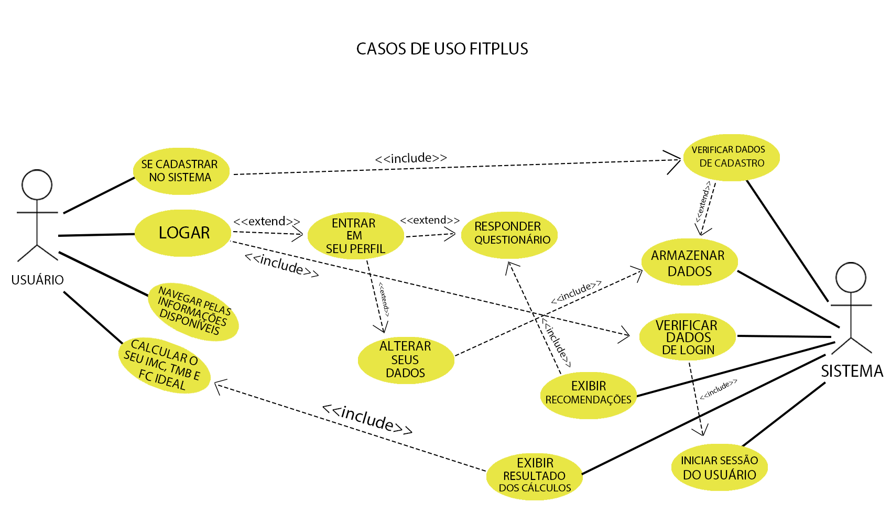
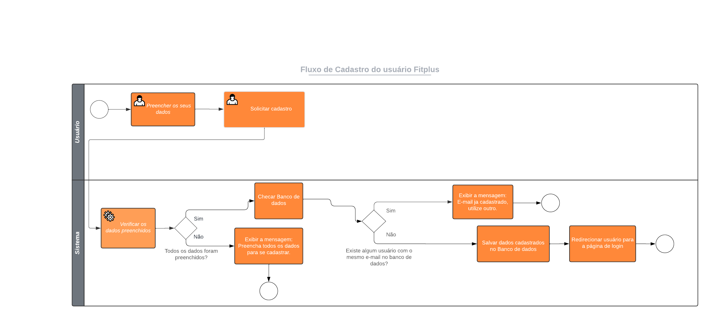

# Definição de Macro Arquitetura

# CASOS DE USO

# Modulos

## Usuário cadastrado
O usuário cadastrado terá acesso a todas as informações disponíveis no site, poderá realizar os cálculos de IMC, TMB e FC ideal, terá acesso a uma área exclusiva para usuários cadastrados onde receberá informações fitness baseadas em seus dados, poderá responder um questionário que se respondido exibirá recomendações, poderá alterar seus dados e redefinir sua senha.

## Usuário não cadastrado
O usuário que não está cadastrado no site terá acesso a todas as informações disponíveis no site, poderá realizar os cálculos de IMC, TMB e FC ideal e poderá se cadastrar para obter acesso a mais funcionalidades.

# Fluxogramas

## Fluxo de cadastro 

## Fluxo de Login 

## Fluxo de Cálculos 

## Fluxo de Alteração de dados 

## Fluxo de alteração de senha 

## Fluxo de redefinição de senha 

## Arquitetura
A arquitetura utilizada será a MVC com o view sendo as páginas html estilizadas com css e animada com java script, o controller o php para gerenciando as solicitações do sistema e o model o banco de dados armazenando e disponibilizando as informações necessárias.

## Front-End
Para fazer o front-end utilizaremos o html para construir o sistema e adicionar conteúdos, cada parte do sistema terá sua página html, para estilizar o sitema utilizaremos o css, a estilizção deixara o sistema responsivo sendo compativel com as telas de todos os dispositiovs e para criar as animações e realizar os cálculos(IMC,TMB,FC ideal) na função testes utilizaremos java script.   

## Back-end
No back-end utilizaremos o php para criar a logica do sistema e fazer a conexão com o banco de dados, enviando os dados do cadastro, verificando os dados cadastrados para o login e alterando os dados cadastrados.

## Banco de dados
Para criar o banco de dados utilizaremos o mysql da seguinte forma: criando uma tabela com as seguintes colunas id,nome,email,senha,altura,sexo e datanasc,questao1,questao2,questao3,questao4,questionariorespondido sendo id declarado como INT e AI, nome VAR CHAR com o valor 45, email VAR CHAR com o valor 110, senha VAR CHAR com o valor 45, altura VAR CHAR com o valor 15, peso VAR CHAR com o valor 15, datanasc DATE, sexo VAR CHAR com o valor 15, questao1 VAR CHAR com o valor 15, questao2 VAR CHAR com o valor 15, questao 3 VAR CHAR com o valor 15, questao3 VAR CHAR com o valor 15, questao4 VAR CHAR com o valor 15 e questionariorespondido INT como valor 1.

## Servidor
O sistema ficará hospedado em um servidor da empresa hostgator.
