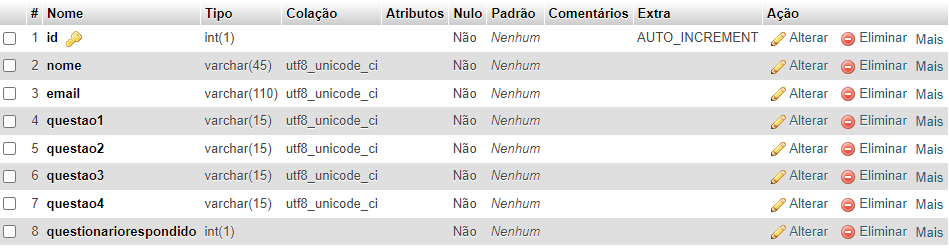

# Definição de Macro Arquitetura

# CASOS DE USO

#### 1.SE CADASTRAR NO SISTEMA
O usuário terá a possibilidade de se cadastrar no sistema para receber dados e funcionalidades exclusivas para usuários cadastrados, a ação de se cadastrar so será concluida após o sistena verificar se os dados digitados pelo usuário ja existem no banco de dados.

#### 2.LOGAR 
O usuário poderá logar no sistema para acessar o seu perfil, o login somente será concluido após o sistema verificar se os dados digitados estão corretos de acordo com o banco dados.

##### 3.NAVEGAR PELAS INFORMAÇÕES DISPONÍVEIS
O usuário poderá navegar por todas as informações disponíveis no sitema.

#### 4.CALCULAR O SEU IMC, TMB E FC IDEAL
O usuário poderá realizar os calculos de IMC, TMB e FC ideal preenchendo os dados necessários para o cálculo.

#### 5.ENTRAR EM SEU PERFIL
O usuário que estiver logado no sistema poderá entrar em seu perfil para acessar ou alterar suas informações cadastradas e ter acesso as demais funcionalidades.

#### 6.RESPONDER QUESTIONÁRIO
O usuário que estiver logado e entrado em seu perfil poderá responder o questionário para receber recomendações do sistema.

#### 7.EXIBIR RECOMENDAÇÕES
O sistema exibirá recomendações no perfil dos usuários que tenham respondido o questionário.

#### 8.ALTERAR SEUS DADOS
O usuário que esta logado e entrou em seu perfil poderá alterar seus dados cadastrados. 

#### 9.VERIFICAR DADOS DE CADASTRO

Após o usuário inserir suas informações de cadastro, o sistema deve conferir:
Se as informações foram todas preenchidas;
Se as informações inseridas estão corretas;
Se já existe algum cadastro com o email inserido no banco de dados.

#### 10.ARMAZENAR DADOS 
Após o sistema conferir e verificar os dados de cadastro, o sistema irá armazenar as informações do usuário, criar um ID único e criptografar a senha.
Após o usuário alterar seus dados, o sistema irá substituir ou adicionar as informações inseridas.

#### 11.VERIFICAR DADOS DE LOGIN

Após o usuário inserir seus dados e logar, o sistema irá verificar se os dados inseridos estão de acordo com os dados no banco de dados.
Caso não estejam corretos o usuário pode inserir novamente os dados;
Caso estejam corretos iniciará a sessão do usuário.

#### 12.INICIAR SESSÃO DO USUÁRIO

Após o sistema verificar se as informações inseridas estão corretas, irá iniciar a sessão do usuário.

#### 13.EXIBITR RESULTADO DOS CÁLCULOS

Após o usuário inserir as informações necessárias para fazer o cálculo, o sistema irá ler as informações, fazer o cálculo e escrever na tela as informações obtidas.

# Modulos

## Usuário cadastrado
O usuário cadastrado terá acesso a todas as informações disponíveis no site, poderá realizar os cálculos de IMC, TMB e FC ideal, terá acesso a uma área exclusiva para usuários cadastrados onde receberá informações fitness baseadas em seus dados, poderá responder um questionário que se respondido exibirá recomendações, poderá alterar seus dados e redefinir sua senha.

## Usuário não cadastrado
O usuário que não está cadastrado no site terá acesso a todas as informações disponíveis no site, poderá realizar os cálculos de IMC, TMB e FC ideal e poderá se cadastrar para obter acesso a mais funcionalidades.

# Fluxogramas

## Fluxo de cadastro 

## Fluxo de Login 

## Fluxo de Cálculos 

## Fluxo de Alteração de dados 

## Fluxo de recomendações

## Fluxo de alteração de senha 

## Fluxo de redefinição de senha 

## Arquitetura
A arquitetura utilizada será a MVC com o view sendo as páginas html estilizadas com css e animada com java script, o controller o php para gerenciando as solicitações do sistema e o model o banco de dados armazenando e disponibilizando as informações necessárias.

## Front-End
Para fazer o front-end utilizaremos o html para construir o sistema e adicionar conteúdos, cada parte do sistema terá sua página html, para estilizar o sitema utilizaremos o css, a estilizção deixara o sistema responsivo sendo compativel com as telas de todos os dispositiovs e para criar as animações e realizar os cálculos(IMC,TMB,FC ideal) na função testes utilizaremos java script.   

## Back-end
No back-end utilizaremos o php para criar a logica do sistema e fazer a conexão com o banco de dados, enviando os dados do cadastro, verificando os dados cadastrados para o login e alterando os dados cadastrados.

## Banco de dados
Para criar o banco de dados utilizaremos o mysql da seguinte forma: criaremos 4 tabelas para armazenar os dados dos usuários(cadastro,loginsite,usuarios,questionários).
#### Tabela Cadastro
Na tabela cadastro estarão armazenados o id e os dados cadastrados do usuário(Nome,E-mail,Altura,Peso,Data de nascimento, Sexo).

#### Estrutura da tabela:

#### Como serão armazenados os dados:

#### Tabela Loginsite
Na tabela Loginsite estarão armazenados o id, E-mail e a senha cadastrada criptograda ele será utilizado para conferir se os dados de login estão corretos.

#### Estrutura da tabela:

#### Como serão armazenados os dados:

#### Tabela Usuários
Na tabela usuários estarão armazenados o id, os dados do usuário(Nome, E-mail, Altura, Peso, Data de nascimento, Sexo) e o codigo de recuperação que será enviado para o E-mail do usuário caso queira redefinir a senha.

#### Estrutura da tabela:

#### Como serão armazenados os dados:

#### Tabela Questionários
Na tabela questionários estarão armazenados o id, nome, E-mail e as respostas do usuário caso tenha respondido o questionário, a tabela sera utilizada para verificar se o usuário ja respondeu o questionário e quais foram suas respostas para gerar recomendações.

#### Estrutura da tabela:

#### Como os dados serão armazenados:

## Servidor
O sistema ficará hospedado em um servidor da empresa hostgator, o dominio terá o certificado SSL para maior segurança dos usuário que o utilizarem,

### Servidor Banco de Dados
O Banco de Dados ficará hospedado no phpmyadmin disponibilizado pela hostgator.
